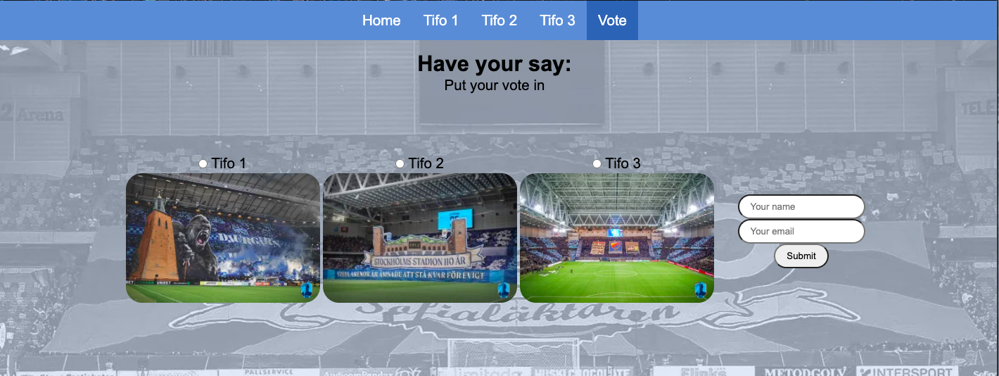
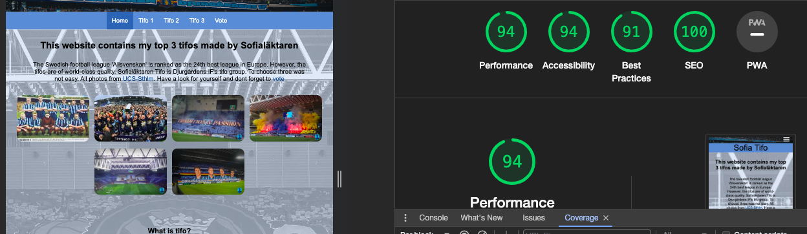

# Sofialäktaren Tifo

# Introduction

What is Tifo you might ask? Tifo, originating from the Italian word "tifosi," refers to the visual displays created by passionate sports fans during matches, particularly in football. This phenomenon involves choreographed flags, signs, or banners in stadium stands, commonly observed in crucial games, local derbies, and rivalries.
This website contains my top 3 tifos created by Sofialäktaren Tifo.
Let's be honest—the football in the Swedish league isn't top-tier; Allsvenskan is currently ranked at number 24 in Europe. However, our supporters and ultras are of top-class quality. The tifos created by our Ultras are world-class. If you're not familiar with tifos, don't worry; you'll soon be aware! The goal of this website is to showcase these incredible displays to the world, with a focus on my team, Djurgårdens IF. Our Tifo Group, Sofialäktaren Tifo, is among the best in Sweden. Enjoy the ride 

[Link to the website](https://jorgendif.github.io/sofiatlaktarentifo/index.html)
# Content
**Table of content:**
* [Introduction](#introduction)
* [UX](#ux)
   * [The Strategy](#the-strategy)
   * [The Scope](#the-scope)
   * [The Structure](#the-structure)
   * [The Skeleton](#the-skeleton)
   * [The Surface](#the-surface)
*   [User Experience](#user-experience) 
    * [First Time User](#first-time-user)
    * [Returning User](#returning-user)
    * [Frequent User](#frequent-user)
*  [Feauters](#feauters)
   * [Header and Navigation Bar](#header-navigation)
   * [The Main Page](#the-main-page)
   * [The Footer](#the-footer)
   * [The Tifo 1-3 Pages](#tifo-1-3)
   * [The Vote Page](#the-vote-page)
   * [Feauters Left To Implement](#feauters-left-to-implement)
*   [Technologies](#technologies)
    * [Language](#language) 
    * [Tools](#tools)
    * [Frameworks & Libaries](#frameworks-libaries) 
*   [Testing](#testing)
    * [Manual Testing](#manual-testing)
    * [Lighthouse](#lighthouse)
    * [Browser Test](#browser-test)
    * [Validation](#validation)
    * [Bugs](#bugs)
*   [Deployment](#deployment) 
     * [Deployment To Github](#deployment-to-github)
     * [Local Deployment](#local-deployment)
*   [Credit](#credit)
     * [Content](#credit-content)
     * [Images](#images)
     * [Thank You](#thank-you)
     

# UX

### The Strategy

   * My objective was to introduce Swedish tifos to a global audience.
   * Primarily targeting football enthusiasts, but also reaching out to those unfamiliar with the concept of tifo.

### The Scope

   * I decided to select my three favorite tifos from Sofialäktaren Tifo and create one page for each.
   * Utilizing the knowledge acquired during the course, I ensured to employ the mobile-first approach.

### The Structure
   * I chose to include a voting page as the final section to add an element of fun. If time permits, I would like to implement live results as well.

### The Skeleton

  * I utilized Balsamiq to create the skeleton or wireframes of the website.
  * My wireframes can be found here 
     * [Wireframes Laptop](/documents/wireframes/Laptop/) 
     * [Wireframes Ipad](/documents/wireframes/Ipad/)
     * [Wireframes Mobile](/documents/wireframes/Mobile/)

    
  

### The Surface

  * With my wife's assistance, I opted for a background with opacity to enhance the overall aesthetic. The primary color of the background became the foundation for the site's color 
    scheme, which includes #3369b, #6090d1, and white.
  * I made sure to create the navbar and footer first as these elements should remain on every page. I found a helpful YouTube video on creating a responsive navbar, which I used as 
    a guideline. Credit for this can be found further down this readme.
  * I made a choice to use the font family :Arial, Helvetica, sans-serif to keep it clean and simple 
  * I decided to include information on what Tifo is, who Sofialäktaren Tifo is, and who Djurgårdens IF is, to provide clarity for any user visiting the index.html page.
  * I also wanted to include a few images of tifos and the team Djurgården to illustrate what it's all about.
  * I came up with the idea to use flexbox to optimize the index page for larger screens, ensuring it fills up the screen appropriately turn the indexpage around to fill up the screen 
   on larger screens

   

   # User Experience

   
    
   ### First Time User

   * As a first time user I would like to easily find what I´m looking for in the menu
   * As a first time user I would like to get entertained
   * As a first time user I would like to feel at home on the website

   <a id=returning-user>

### Returning User

* As a returning user I would love to see the images again
* As a returning user I would loose myself in the videos again
* As a returning user I´m hoping for new content

<a id=frequent-user>

### Frequent User

* As a frequent user, I want the site to evolve while maintaining a familiar feel
* As a frequent user, I'd like more voting options and the possibility of participating in competitions
* As a frequent user, I wish to have the option to purchase merchandise.

# Features

### Header and Navigation Bar
  * Present on all five pages, the header and navigation bar provide consistent elements.
  * The navigation bar boasts a responsive and functional design, complemented by an appealing header image.
  * The image credit is further down this file
  

### The Main Page
  
  * Serving as the heart of the website, the main page (index.html) captures the essence of my platform.
  * This section not only communicates what the website is about but also features images, enhancing its visual appeal.
  * Carefully curated information aims to create a welcoming atmosphere, ensuring that every visitor feels invited to explore further.
  * Further down the page, proper credit has been given to the talented creators of the showcased images, acknowledging their contribution to the website's visual richness.
  * The background image is consistent on all 5 pages

    

### The Footer

  * Across all five pages, a consistent footer design has been implemented to provide a better experience.
  * This section incorporates direct links to Sofialäktaren's social networks, fostering easy connectivity with the community.
  * Additionally, a link to Djurgårdens IF's official website is included, allowing visitors quick access to the team's broader online presence.

  

### Tifo 1-3 Pages

  * Pages named Tifo 1-3 show cool pictures and details about the tifos I really like.
  * Each page has a video from YouTube to give you a better look at the tifos. For one of them, there's a link since I couldn't put the video directly.
  * It's a fun way to explore and learn more about these tifos.
  * I've given credit to all the images used on the website. You can find this information further down the readme page.
  * It's important to acknowledge and appreciate the work of those who captured these amazing moments.
    
  

### The Vote Page
  * The Vote page encourages users to participate by voting for their favorite tifo.
  * Users can choose from three options and are required to provide their name and email for the voting process.

  

 

### Features Left to Implement
  * A live poll that displays the voting results directly on the Voting page.
  * Maybe in the future make my favourite tifos of every season

# Technologies

### Language
   * HTML
   * CSS
   * JavaScript

   

 ### Tools
   * VScode  
   * Balsamiq
   * Codeanywhere
   * Github
   * HTML Validator
   * CSS Validator

   <a id=frameworks-libaries>

 ### Frameworks & Libaries
   * [Favicon](https://favicon.io/)
   * [Fontawesome](https://fontawesome.com/)

<a id=testing>

 # Testing 

 ### Manual Testing

| Feature | Description | Steps | Outcome |
| --- | --- | --- | --- |
| Home Button in the menu | Takes you to index.html| Press Home Button | Navigates to index.html |
| Tifo 1 button in the menu | Takes you to tifo1.html | Press Tifo 1 Button | Navigates to tifo1.html |
| Tifo 2 button in the menu | Takes you to tifo2.html | Press Tifo 2 Button | Navigates to tifo2.html |
| Tifo 3 button in the menu | Takes you to tifo3.html | Press Tifo 3 Button | Navigates to tifo3.html |
| Vote Button in the menu | Takes you to vote.html | Press Vote Button | Navigates to vote.html|
| Hamburger button in mobilemode | Opens menu | Press Hamburger| Opens menu |
| Submit Button in the vote page | Takes you to thank you page| Press Submit Button | Not ready yet |
| Links in the Footer | Takes you to social media| Press any of the buttons | Navigates to the right social media site |
| Links to photo sources | Takes you to sources| Press link Button | Navigates to the source |
| Youtube videos | Plays the videos | Press play | Videos starts |

### Lighthouse

* Performed a lighthouse test in Devtools with this outcome

### Browser Test

* I tested my Website with : Safari, Google Chrome and Microsoft Edge. No errors occured on any device

 <a id=validation>

### Validation

* I did a HTML validation with [W3C HTML-Validator](https://validator.w3.org/#validate_by_input) that showed no errors on any of my 5 pages

* I did a CSS validation with [W3C CSS-Validator](https://jigsaw.w3.org/css-validator/) that showed no errors

### Bugs

| Bug | Status | Description | Steps To Resolve |
| --- | --- | --- | --- |
| Hamburger menu not at the same spot | ~~Resolved~~  | The button is moving while changing device | Go through CSS
| Text centered | ~~Resolved~~  | Text centered text is hard to read | Align text to the sides |
| Images too big and site not responsive | ~~Resolved~~ | The images was to big and not in order  | Used flexbox and resized images |
| The vote page had empty space on big screen | ~~Resolved~~ | The images on the page was in a column  | Used media device to get them in a row while on bigger screens |

# Deployment

### Deployment To Github
  
  * Once code has been completed, it is pushed to Github for deployment using the pages feature. The site is now accessible via: [Sofialaktarentifo](https://jorgendif.github.io/sofiatlaktarentifo/index.html)

   Steps needed to deploy

* Navigate to the repository on github and click settings.
* Then select pages on the side navigation.
* Select the none dropdown, and then click main.
* Click on the save button.
* If any changes are required, they can be done, commited and pushed to GitHub and the changes  will be updated.

### Local Deployment

 * Made a local deployment on my computer

 .png>)

 

# Credit
 
 * The following section acknowledges and credits all borrowed content and images
 
 

 ### Content

 * The hamburger menu is mainly inspired by this YouTube video [Responsive Navbar](https://www.youtube.com/watch?v=At4B7A4GOPg)

 * The text about every Tifo is taken from [Sofialäktarens Instagram](https://www.instagram.com/sofialaktaren/)

 * The translations from swedish to english was made with help of Google Translate and [Chat GPT](https://chat.openai.com/c/40b00b12-d494-429b-bcbe-beef367157f8)

 * The about Tifo, about Sofialäktaren Tifo and about Djurgården is partly borrowed from [Wikipedia](https://sv.wikipedia.org/wiki/Portal:Huvudsida)

 
* The footers items is from [Fontawseome](https://fontawesome.com/) and [Wikipedia](https://sv.wikipedia.org/wiki/Portal:Huvudsida)

* The reade me is inspired by other users readmes : [mindyoga](https://github.com/AliOKeeffe/mindyoga/blob/main/README.md),
   [vinviant](https://github.com/klchambers/VinVivant/blob/main/README.md) and from [Love Running Project](https://github.com/Code-Institute-Solutions/readme-template/blob/master/README.md)

 

 ### Media

 * The background image is from [UCS Stockholm](https://www.ultracaosstockholm.se/hem/) but changed the opacity

 * The images on the index.html are from [UCS Stockholm](https://www.ultracaosstockholm.se/hem/)
 , [Wikipedia](https://sv.wikipedia.org/wiki/Portal:Huvudsida) and [DIF Arkivet](https://www.difarkivet.se/)

 * The header image is from [UCS Stockholm](https://www.ultracaosstockholm.se/hem/)
 
 * The Tifo 1-3 and Vote images are from [UCS Stockholm](https://www.ultracaosstockholm.se/hem/)
 and [DIF X-Site](https://twitter.com/DIF_Fotboll?ref_src=twsrc%5Egoogle%7Ctwcamp%5Eserp%7Ctwgr%5Eauthor)
 

* The YouTube videos on the Tifo Pages are from [DIF Västerort](https://www.youtube.com/watch?v=M8yLrBLfejk) and [DIF Nytt](https://www.youtube.com/watch?v=vPkJQ801mG0)

### Thank You

* My wife and family
* Djurgårdens IF for everything
* Sofialäktaren Tifo
* Slack Community 

